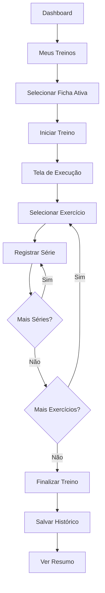
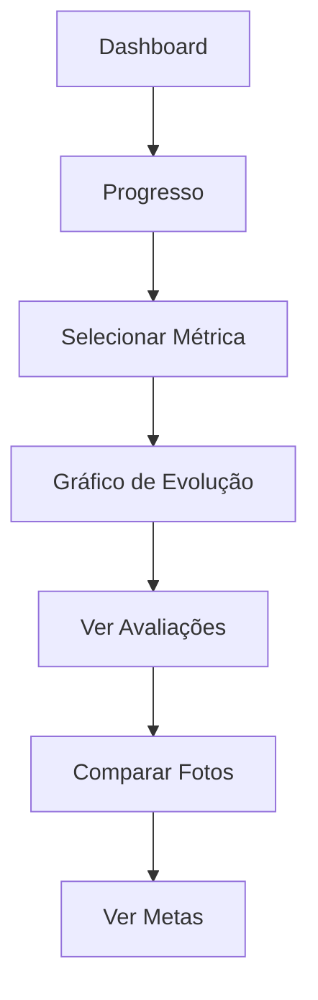
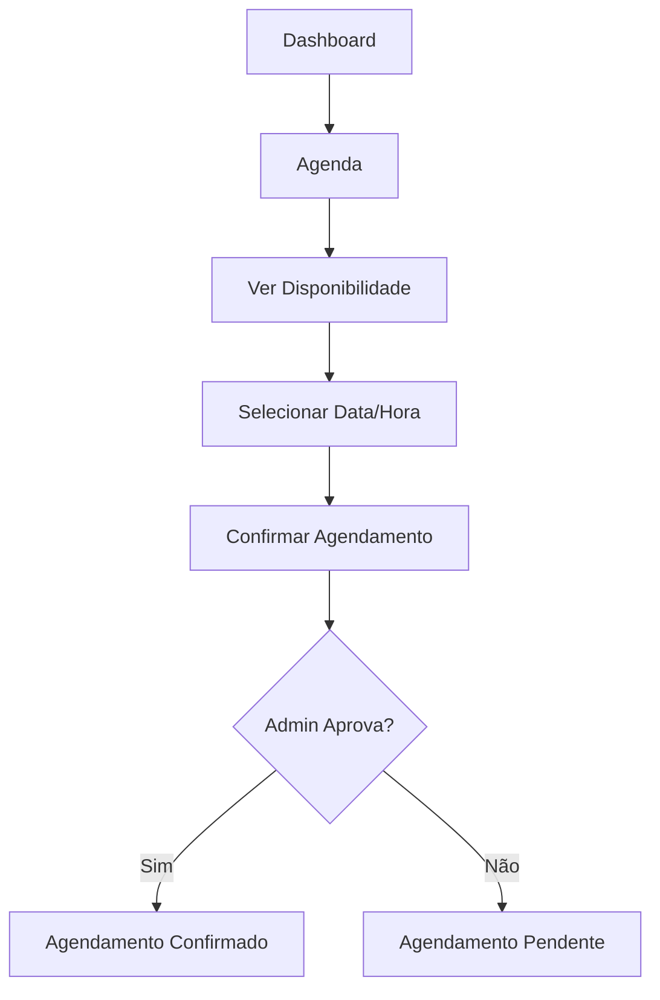
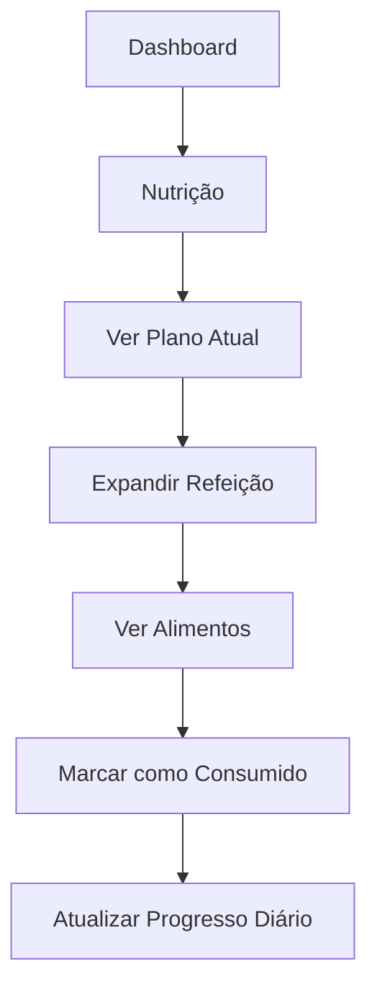
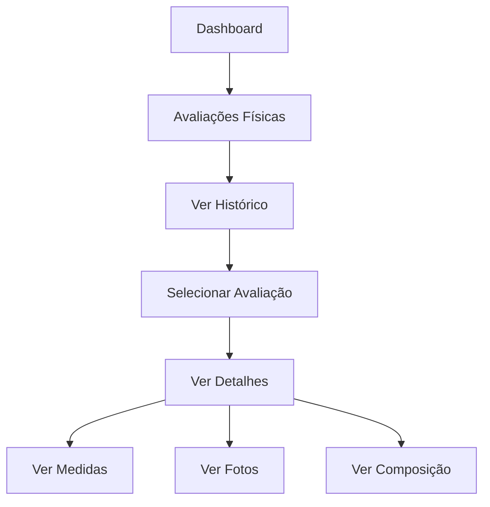

# 📋 PLANEJAMENTO TÉCNICO COMPLETO - PAINEL DO ALUNO

**Versão:** 1.0  
**Data:** 07/12/2025  
**Objetivo:** Finalização completa do Painel do Aluno com integração total aos dados do Painel Admin  
**Usuário de Teste:** eugabrieldpv@gmail.com

---

## 📑 ÍNDICE

1. [Visão Geral](#1-visão-geral)
2. [Estrutura de Dados do Aluno](#2-estrutura-de-dados-do-aluno)
3. [Mapeamento Admin → Aluno](#3-mapeamento-admin--aluno)
4. [Arquitetura e Componentes](#4-arquitetura-e-componentes)
5. [Rotas e Navegação](#5-rotas-e-navegação)
6. [Hooks e Integrações](#6-hooks-e-integrações)
7. [Fluxos de Ações do Aluno](#7-fluxos-de-ações-do-aluno)
8. [Configuração do Usuário de Teste](#8-configuração-do-usuário-de-teste)
9. [Checklist de Implementação](#9-checklist-de-implementação)
10. [Dependências Técnicas](#10-dependências-técnicas)

---

## 1. VISÃO GERAL

### 1.1 Contexto Atual

O sistema possui um **Painel Admin** completo e funcional com as seguintes funcionalidades:
- Gestão de alunos (CRUD completo)
- Fichas de treino (criação, atribuição, exercícios)
- Planos alimentares (refeições, alimentos, macros)
- Avaliações físicas (protocolos, medidas, fotos)
- Avaliações posturais (análise postural, fotos)
- Agenda profissional (blocos, agendamentos, exceções)
- Pagamentos (assinaturas, controle financeiro)
- Vídeos de treino (biblioteca de exercícios)
- PDFs de treino (documentos)

### 1.2 Objetivo do Painel do Aluno

Criar uma interface **read-only** e **consumível** onde o aluno pode:
- ✅ Visualizar seus dados e progresso
- ✅ Consumir conteúdo atribuído (treinos, nutrição, vídeos)
- ✅ Registrar execução de treinos
- ✅ Agendar horários disponíveis
- ✅ Acompanhar evolução e metas
- ❌ NÃO pode editar dados mestres (criados pelo admin)


---

## 2. ESTRUTURA DE DADOS DO ALUNO

### 2.1 Tabelas Principais

#### **users_profile** (Perfil Base)
```typescript
{
  id: string;
  auth_uid: string;        // Vinculado ao Supabase Auth
  nome: string;
  email: string;
  tipo: "aluno";           // CRÍTICO: Define acesso ao painel
  foto_url: string | null;
  created_at: timestamp;
  updated_at: timestamp;
}
```

#### **alunos** (Dados Específicos)
```typescript
{
  id: string;
  user_profile_id: string; // FK → users_profile
  data_nascimento: date;
  altura: number;          // em cm
  genero: string;
  status: "ativo" | "pendente" | "inativo";
  created_at: timestamp;
  updated_at: timestamp;
}
```

### 2.2 Relacionamentos Críticos

```
users_profile (tipo: aluno)
    ↓
alunos
    ↓
    ├── fichas_alunos (treinos atribuídos)
    ├── planos_alimentares (nutrição)
    ├── agendamentos_presenciais (agenda)
    ├── avaliacoes_fisicas (medidas, fotos)
    ├── avaliacoes_posturais (postura)
    ├── anamneses (histórico de saúde)
    ├── metas_avaliacoes (objetivos)
    └── assinaturas (pagamentos)
```

### 2.3 Dados Derivados

**Treinos Realizados:**
```
fichas_alunos → treinos_realizados → series_realizadas
```

**Evolução:**
```
avaliacoes_fisicas (ordenadas por data) → gráficos de progresso
```

**Histórico de Pagamentos:**
```
assinaturas → pagamentos (histórico financeiro)
```


---

## 3. MAPEAMENTO ADMIN → ALUNO

### 3.1 Funcionalidades por Módulo

| Módulo Admin | Ação Admin | Visualização Aluno | Interação Aluno |
|--------------|------------|-------------------|-----------------|
| **Gestão de Alunos** | Criar/Editar perfil | Ver próprio perfil | Editar foto, dados básicos |
| **Fichas de Treino** | Criar ficha, atribuir | Ver fichas atribuídas | Iniciar treino, registrar séries |
| **Exercícios** | Adicionar à ficha | Ver lista de exercícios | Marcar como concluído |
| **Planos Alimentares** | Criar plano, refeições | Ver plano atual | Marcar refeições consumidas |
| **Avaliações Físicas** | Criar avaliação, medidas | Ver histórico completo | Upload de fotos de progresso |
| **Avaliações Posturais** | Criar avaliação postural | Ver análises posturais | Visualizar fotos |
| **Agenda** | Criar blocos, gerenciar | Ver horários disponíveis | Solicitar agendamento |
| **Pagamentos** | Criar assinatura, cobrar | Ver status de pagamento | Visualizar histórico |
| **Vídeos de Treino** | Upload de vídeos | Biblioteca completa | Assistir, favoritar |
| **PDFs de Treino** | Upload de PDFs | Ver PDFs atribuídos | Download |

### 3.2 Regras de Acesso (RLS Policies)

**Princípio:** Aluno só acessa **seus próprios dados**

```sql
-- Exemplo de Policy para fichas_alunos
CREATE POLICY "alunos_view_own_fichas"
ON fichas_alunos FOR SELECT
USING (
  aluno_id IN (
    SELECT a.id FROM alunos a
    INNER JOIN users_profile up ON a.user_profile_id = up.id
    WHERE up.auth_uid = auth.uid()
  )
);
```

**Tabelas com RLS necessário:**
- ✅ `alunos` (próprio registro)
- ✅ `fichas_alunos` (fichas atribuídas)
- ✅ `planos_alimentares` (plano próprio)
- ✅ `agendamentos_presenciais` (agendamentos próprios)
- ✅ `avaliacoes_fisicas` (avaliações próprias)
- ✅ `avaliacoes_posturais` (avaliações próprias)
- ✅ `anamneses` (anamnese própria)
- ✅ `metas_avaliacoes` (metas próprias)
- ✅ `treinos_realizados` (treinos próprios)
- ✅ `series_realizadas` (séries próprias)
- 🔓 `treinos_video` (todos podem ver)
- 🔓 `disponibilidade_semanal` (todos podem ver)


---

## 4. ARQUITETURA E COMPONENTES

### 4.1 Estrutura de Diretórios

```
client/src/
├── pages/aluno/
│   ├── Dashboard.tsx              ✅ IMPLEMENTADO
│   ├── MeusTreinos.tsx            ✅ IMPLEMENTADO
│   ├── TreinoExecucao.tsx         ✅ IMPLEMENTADO
│   ├── Nutricao.tsx               ✅ IMPLEMENTADO
│   ├── Agenda.tsx                 ✅ IMPLEMENTADO
│   ├── Progresso.tsx              ✅ IMPLEMENTADO
│   ├── AvaliacoesFisicas.tsx      🔨 A IMPLEMENTAR
│   ├── AvaliacoesPosturais.tsx    🔨 A IMPLEMENTAR
│   ├── BibliotecaVideos.tsx       🔨 A IMPLEMENTAR
│   ├── Perfil.tsx                 🔨 A IMPLEMENTAR
│   ├── Pagamentos.tsx             🔨 A IMPLEMENTAR
│   └── Metas.tsx                  🔨 A IMPLEMENTAR (parcial)
│
├── components/aluno/
│   ├── AlunoLayout.tsx            ✅ IMPLEMENTADO
│   ├── AlunoSidebar.tsx           ✅ IMPLEMENTADO
│   ├── TreinoCard.tsx             🔨 A CRIAR
│   ├── ExercicioCard.tsx          🔨 A CRIAR
│   ├── RegistroSerieModal.tsx     🔨 A CRIAR
│   ├── RefeicaoCard.tsx           🔨 A CRIAR
│   ├── AvaliacaoCard.tsx          🔨 A CRIAR
│   ├── GraficoEvolucao.tsx        🔨 A CRIAR
│   ├── CalendarioAgenda.tsx       🔨 A CRIAR
│   └── VideoPlayer.tsx            ✅ EXISTE (reutilizar)
│
└── hooks/
    ├── useAlunoData.ts            ✅ IMPLEMENTADO (parcial)
    ├── useAvaliacoesFisicas.ts    🔨 EXPANDIR
    ├── useAvaliacoesPosturais.ts  ✅ EXISTE
    ├── useTreinosRealizados.ts    🔨 A CRIAR
    ├── useMetasAluno.ts           🔨 A CRIAR
    └── usePagamentosAluno.ts      🔨 A CRIAR
```

### 4.2 Componentes Principais

#### **AlunoLayout** (Base)
```typescript
interface AlunoLayoutProps {
  children: React.ReactNode;
}

// Features:
// - Sidebar com navegação
// - Header com nome do aluno
// - Botão de logout
// - Responsivo (mobile-first)
```

#### **TreinoCard** (Novo)
```typescript
interface TreinoCardProps {
  ficha: FichaAluno;
  onIniciar: (fichaId: string) => void;
  showProgress?: boolean;
}

// Features:
// - Exibe nome, descrição, objetivo
// - Mostra progresso (X/Y exercícios)
// - Botão "Iniciar Treino"
// - Badge de status
```

#### **ExercicioCard** (Novo)
```typescript
interface ExercicioCardProps {
  exercicio: ExercicioFicha;
  onRegistrarSerie: (dados: SerieRealizada) => void;
  seriesRealizadas: SerieRealizada[];
}

// Features:
// - Nome, grupo muscular
// - Séries x Reps planejadas
// - Input para carga e reps realizadas
// - Botão "Registrar Série"
// - Histórico de séries do dia
```

#### **GraficoEvolucao** (Novo)
```typescript
interface GraficoEvolucaoProps {
  avaliacoes: AvaliacaoFisica[];
  metrica: "peso" | "percentual_gordura" | "massa_magra";
}

// Features:
// - Gráfico de linha (Recharts)
// - Filtro por período (1m, 3m, 6m, 1a)
// - Marcadores de metas
// - Tooltip com detalhes
```


---

## 5. ROTAS E NAVEGAÇÃO

### 5.1 Estrutura de Rotas

```typescript
// App.tsx - Rotas do Aluno
<Switch>
  <Route path="/aluno" component={AlunoDashboard} />
  <Route path="/aluno/dashboard" component={AlunoDashboard} />
  
  {/* Treinos */}
  <Route path="/aluno/treinos" component={MeusTreinos} />
  <Route path="/aluno/treino/:fichaAlunoId" component={TreinoExecucao} />
  <Route path="/aluno/videos" component={BibliotecaVideos} />
  
  {/* Nutrição */}
  <Route path="/aluno/nutricao" component={Nutricao} />
  
  {/* Avaliações */}
  <Route path="/aluno/avaliacoes" component={AvaliacoesFisicas} />
  <Route path="/aluno/avaliacoes-posturais" component={AvaliacoesPosturais} />
  <Route path="/aluno/progresso" component={Progresso} />
  <Route path="/aluno/metas" component={Metas} />
  
  {/* Agenda */}
  <Route path="/aluno/agenda" component={AgendaAluno} />
  
  {/* Perfil e Configurações */}
  <Route path="/aluno/perfil" component={Perfil} />
  <Route path="/aluno/pagamentos" component={Pagamentos} />
  
  <Route component={NotFound} />
</Switch>
```

### 5.2 Sidebar Navigation

```typescript
const menuItems = [
  {
    label: "Dashboard",
    icon: Home,
    path: "/aluno/dashboard",
  },
  {
    label: "Meus Treinos",
    icon: Dumbbell,
    path: "/aluno/treinos",
  },
  {
    label: "Biblioteca de Vídeos",
    icon: Video,
    path: "/aluno/videos",
  },
  {
    label: "Nutrição",
    icon: Apple,
    path: "/aluno/nutricao",
  },
  {
    label: "Avaliações Físicas",
    icon: Activity,
    path: "/aluno/avaliacoes",
  },
  {
    label: "Progresso",
    icon: TrendingUp,
    path: "/aluno/progresso",
  },
  {
    label: "Metas",
    icon: Target,
    path: "/aluno/metas",
  },
  {
    label: "Agenda",
    icon: Calendar,
    path: "/aluno/agenda",
  },
  {
    label: "Pagamentos",
    icon: CreditCard,
    path: "/aluno/pagamentos",
  },
  {
    label: "Perfil",
    icon: User,
    path: "/aluno/perfil",
  },
];
```

### 5.3 Proteção de Rotas

```typescript
// App.tsx - Auth Guard
useEffect(() => {
  const checkAuth = async () => {
    const { data: { session } } = await supabase.auth.getSession();
    
    if (!session) {
      setLocation('/login');
      return;
    }
    
    // Buscar perfil
    const { data: profile } = await supabase
      .from('users_profile')
      .select('tipo')
      .eq('auth_uid', session.user.id)
      .single();
    
    // Redirecionar se não for aluno
    if (profile?.tipo !== 'aluno' && location.startsWith('/aluno')) {
      setLocation('/admin');
    }
  };
  
  checkAuth();
}, [location]);
```


---

## 6. HOOKS E INTEGRAÇÕES

### 6.1 Hooks Existentes (useAlunoData.ts)

```typescript
// ✅ JÁ IMPLEMENTADOS
export function useAlunoProfile()
export function useAlunoFichas(alunoId: string)
export function useAlunoPlanoAlimentar(alunoId: string)
export function useAlunoAgendamentos(alunoId: string)
export function useAlunoEvolucao(alunoId: string)
export function useAlunoFotosProgresso(alunoId: string)
export function useAlunoAssinatura(alunoId: string)
export function useVideosDisponiveis()
export function useHistoricoTreinos(fichaAlunoId: string)
```

### 6.2 Hooks a Criar

#### **useTreinosRealizados.ts**
```typescript
// Registrar treino realizado
export function useRegistrarTreino() {
  return useMutation({
    mutationFn: async (dados: {
      fichaAlunoId: string;
      exercicioId: string;
      series: Array<{
        numeroSerie: number;
        carga: string;
        repeticoes: number;
      }>;
    }) => {
      // 1. Criar treino_realizado
      const { data: treino } = await supabase
        .from('treinos_realizados')
        .insert({
          ficha_aluno_id: dados.fichaAlunoId,
          exercicio_id: dados.exercicioId,
          data_realizacao: new Date().toISOString(),
          series_realizadas: dados.series.length,
        })
        .select()
        .single();
      
      // 2. Criar series_realizadas
      const series = dados.series.map(s => ({
        treino_realizado_id: treino.id,
        numero_serie: s.numeroSerie,
        carga: s.carga,
        repeticoes: s.repeticoes,
        concluida: 'true',
      }));
      
      await supabase
        .from('series_realizadas')
        .insert(series);
      
      return treino;
    },
    onSuccess: () => {
      queryClient.invalidateQueries(['historico-treinos']);
    },
  });
}

// Buscar estatísticas de treino
export function useEstatisticasTreino(fichaAlunoId: string) {
  return useQuery({
    queryKey: ['estatisticas-treino', fichaAlunoId],
    queryFn: async () => {
      const { data } = await supabase
        .from('treinos_realizados')
        .select('*, series_realizadas(*)')
        .eq('ficha_aluno_id', fichaAlunoId);
      
      // Calcular:
      // - Total de treinos
      // - Volume total (kg)
      // - Exercício mais realizado
      // - Progresso de carga
      
      return calcularEstatisticas(data);
    },
  });
}
```

#### **useAvaliacoesFisicasAluno.ts**
```typescript
export function useAvaliacoesFisicasAluno(alunoId: string) {
  return useQuery({
    queryKey: ['avaliacoes-fisicas-aluno', alunoId],
    queryFn: async () => {
      const { data, error } = await supabase
        .from('avaliacoes_fisicas')
        .select(`
          *,
          perimetria_detalhada(*),
          avaliacoes_neuromotoras(*),
          avaliacoes_posturais(*)
        `)
        .eq('aluno_id', alunoId)
        .order('data_avaliacao', { ascending: false });
      
      if (error) throw error;
      return data;
    },
    enabled: !!alunoId,
  });
}

export function useAvaliacaoFixada(alunoId: string) {
  return useQuery({
    queryKey: ['avaliacao-fixada', alunoId],
    queryFn: async () => {
      const { data } = await supabase
        .from('avaliacoes_fisicas')
        .select('*')
        .eq('aluno_id', alunoId)
        .eq('fixada', true)
        .maybeSingle();
      
      return data;
    },
  });
}
```

#### **useMetasAluno.ts**
```typescript
export function useMetasAluno(alunoId: string) {
  return useQuery({
    queryKey: ['metas-aluno', alunoId],
    queryFn: async () => {
      const { data } = await supabase
        .from('metas_avaliacoes')
        .select('*')
        .eq('aluno_id', alunoId)
        .order('data_inicio', { ascending: false });
      
      return data;
    },
  });
}

export function useProgressoMeta(metaId: string, alunoId: string) {
  return useQuery({
    queryKey: ['progresso-meta', metaId],
    queryFn: async () => {
      // Buscar meta
      const { data: meta } = await supabase
        .from('metas_avaliacoes')
        .select('*')
        .eq('id', metaId)
        .single();
      
      // Buscar avaliações no período
      const { data: avaliacoes } = await supabase
        .from('avaliacoes_fisicas')
        .select('peso, percentual_gordura, massa_magra, data_avaliacao')
        .eq('aluno_id', alunoId)
        .gte('data_avaliacao', meta.data_inicio)
        .order('data_avaliacao', { ascending: true });
      
      // Calcular progresso
      return calcularProgressoMeta(meta, avaliacoes);
    },
  });
}
```

#### **usePagamentosAluno.ts**
```typescript
export function usePagamentosAluno(alunoId: string) {
  return useQuery({
    queryKey: ['pagamentos-aluno', alunoId],
    queryFn: async () => {
      const { data } = await supabase
        .from('assinaturas')
        .select(`
          *,
          pagamentos(*)
        `)
        .eq('aluno_id', alunoId)
        .order('data_inicio', { ascending: false });
      
      return data;
    },
  });
}

export function useStatusAssinatura(alunoId: string) {
  return useQuery({
    queryKey: ['status-assinatura', alunoId],
    queryFn: async () => {
      const { data } = await supabase
        .from('assinaturas')
        .select('*, pagamentos(*)')
        .eq('aluno_id', alunoId)
        .eq('status', 'ativa')
        .maybeSingle();
      
      if (!data) return { status: 'inativa', diasRestantes: 0 };
      
      // Calcular dias restantes
      const dataFim = new Date(data.data_fim);
      const hoje = new Date();
      const diasRestantes = Math.ceil((dataFim.getTime() - hoje.getTime()) / (1000 * 60 * 60 * 24));
      
      return {
        status: data.status,
        diasRestantes,
        proximoVencimento: data.data_fim,
        valor: data.valor,
      };
    },
  });
}
```


---

## 7. FLUXOS DE AÇÕES DO ALUNO

### 7.1 Fluxo: Executar Treino



**Implementação:**
1. **MeusTreinos.tsx**: Lista fichas ativas
2. **TreinoExecucao.tsx**: Interface de execução
3. **RegistroSerieModal.tsx**: Modal para registrar carga/reps
4. **useRegistrarTreino**: Hook para salvar dados

### 7.2 Fluxo: Visualizar Progresso



**Implementação:**
1. **Progresso.tsx**: Dashboard de evolução
2. **GraficoEvolucao.tsx**: Gráficos interativos
3. **AvaliacaoCard.tsx**: Card de avaliação
4. **ComparadorFotos.tsx**: Comparação lado a lado

### 7.3 Fluxo: Agendar Horário



**Implementação:**
1. **AgendaAluno.tsx**: Calendário de disponibilidade
2. **CalendarioAgenda.tsx**: Componente de calendário
3. **useSolicitarAgendamento**: Hook para criar solicitação

### 7.4 Fluxo: Consumir Plano Alimentar



**Implementação:**
1. **Nutricao.tsx**: Visualização do plano
2. **RefeicaoCard.tsx**: Card de refeição
3. **useMarcarRefeicao**: Hook para tracking

### 7.5 Fluxo: Visualizar Avaliações



**Implementação:**
1. **AvaliacoesFisicas.tsx**: Lista de avaliações
2. **AvaliacaoDetalheModal.tsx**: Modal com detalhes
3. **useAvaliacoesFisicasAluno**: Hook de dados


---

## 8. CONFIGURAÇÃO DO USUÁRIO DE TESTE

### 8.1 Dados do Usuário

**Email:** eugabrieldpv@gmail.com  
**Senha:** @gab123654  
**Nome:** Gabriel Douglas  
**Tipo:** aluno

### 8.2 Script de Configuração Completa

```sql
-- 1. Verificar/Criar usuário no Supabase Auth
-- (Feito via Supabase Dashboard ou Auth API)

-- 2. Criar perfil de usuário
INSERT INTO users_profile (auth_uid, nome, email, tipo, foto_url)
VALUES (
  'AUTH_UID_DO_SUPABASE', -- Substituir pelo auth.uid() real
  'Gabriel Douglas',
  'eugabrieldpv@gmail.com',
  'aluno',
  NULL
)
ON CONFLICT (email) DO UPDATE
SET tipo = 'aluno';

-- 3. Criar registro de aluno
INSERT INTO alunos (user_profile_id, data_nascimento, altura, genero, status)
SELECT 
  id,
  '1995-03-15'::date,
  178,
  'masculino',
  'ativo'
FROM users_profile
WHERE email = 'eugabrieldpv@gmail.com'
ON CONFLICT DO NOTHING;

-- 4. Atribuir ficha de treino
WITH aluno AS (
  SELECT a.id as aluno_id
  FROM alunos a
  INNER JOIN users_profile up ON a.user_profile_id = up.id
  WHERE up.email = 'eugabrieldpv@gmail.com'
),
ficha AS (
  SELECT id as ficha_id
  FROM fichas_treino
  WHERE nome = 'Full Body Iniciante'
  LIMIT 1
)
INSERT INTO fichas_alunos (ficha_id, aluno_id, data_inicio, data_fim, status)
SELECT 
  ficha.ficha_id,
  aluno.aluno_id,
  CURRENT_DATE,
  CURRENT_DATE + INTERVAL '8 weeks',
  'ativo'
FROM aluno, ficha
ON CONFLICT DO NOTHING;

-- 5. Criar plano alimentar
WITH aluno AS (
  SELECT a.id as aluno_id
  FROM alunos a
  INNER JOIN users_profile up ON a.user_profile_id = up.id
  WHERE up.email = 'eugabrieldpv@gmail.com'
)
INSERT INTO planos_alimentares (aluno_id, titulo, conteudo_html, observacoes, dados_json)
SELECT 
  aluno_id,
  'Plano Nutricional - Ganho de Massa',
  '<p>Plano focado em hipertrofia muscular</p>',
  'Manter hidratação de 3L/dia',
  '{"calorias_totais": 2800, "proteinas": 180, "carboidratos": 350, "gorduras": 70}'::jsonb
FROM aluno
ON CONFLICT DO NOTHING;

-- 6. Criar agendamentos de teste
WITH aluno AS (
  SELECT a.id as aluno_id
  FROM alunos a
  INNER JOIN users_profile up ON a.user_profile_id = up.id
  WHERE up.email = 'eugabrieldpv@gmail.com'
)
INSERT INTO agendamentos_presenciais (aluno_id, data_agendamento, hora_inicio, hora_fim, status, tipo, observacoes)
SELECT 
  aluno_id,
  CURRENT_DATE + INTERVAL '2 days',
  '14:00',
  '15:00',
  'agendado',
  'presencial',
  'Avaliação física mensal'
FROM aluno
UNION ALL
SELECT 
  aluno_id,
  CURRENT_DATE + INTERVAL '5 days',
  '10:00',
  '11:00',
  'confirmado',
  'online',
  'Consultoria nutricional'
FROM aluno
ON CONFLICT DO NOTHING;

-- 7. Criar avaliação física inicial
WITH aluno AS (
  SELECT a.id as aluno_id
  FROM alunos a
  INNER JOIN users_profile up ON a.user_profile_id = up.id
  WHERE up.email = 'eugabrieldpv@gmail.com'
)
INSERT INTO avaliacoes_fisicas (
  aluno_id, 
  data_avaliacao, 
  peso, 
  altura, 
  imc,
  percentual_gordura,
  massa_magra,
  massa_gorda,
  protocolo,
  genero,
  idade,
  fixada
)
SELECT 
  aluno_id,
  CURRENT_DATE - INTERVAL '7 days',
  '84.0',
  178,
  '26.5',
  '18.5',
  '68.4',
  '15.6',
  'pollock7',
  'masculino',
  29,
  true
FROM aluno
ON CONFLICT DO NOTHING;

-- 8. Criar assinatura ativa
WITH aluno AS (
  SELECT a.id as aluno_id
  FROM alunos a
  INNER JOIN users_profile up ON a.user_profile_id = up.id
  WHERE up.email = 'eugabrieldpv@gmail.com'
)
INSERT INTO assinaturas (aluno_id, plano, valor, data_inicio, data_fim, status, forma_pagamento)
SELECT 
  aluno_id,
  'Mensal Premium',
  250.00,
  CURRENT_DATE - INTERVAL '15 days',
  CURRENT_DATE + INTERVAL '15 days',
  'ativa',
  'pix'
FROM aluno
ON CONFLICT DO NOTHING;

-- 9. Criar meta de avaliação
WITH aluno AS (
  SELECT a.id as aluno_id
  FROM alunos a
  INNER JOIN users_profile up ON a.user_profile_id = up.id
  WHERE up.email = 'eugabrieldpv@gmail.com'
)
INSERT INTO metas_avaliacoes (
  aluno_id,
  peso_alvo,
  percentual_gordura_alvo,
  massa_magra_alvo,
  data_inicio,
  data_alvo,
  prazo_semanas,
  status
)
SELECT 
  aluno_id,
  '80.0',
  '15.0',
  '70.0',
  CURRENT_DATE,
  CURRENT_DATE + INTERVAL '12 weeks',
  12,
  'ativa'
FROM aluno
ON CONFLICT DO NOTHING;
```

### 8.3 Verificação de Dados

```sql
-- Verificar configuração completa
WITH aluno AS (
  SELECT a.id, a.status, up.nome, up.email, up.tipo
  FROM alunos a
  INNER JOIN users_profile up ON a.user_profile_id = up.id
  WHERE up.email = 'eugabrieldpv@gmail.com'
)
SELECT 
  a.nome,
  a.email,
  a.tipo,
  a.status,
  (SELECT COUNT(*) FROM fichas_alunos WHERE aluno_id = a.id) as fichas_count,
  (SELECT COUNT(*) FROM planos_alimentares WHERE aluno_id = a.id) as planos_count,
  (SELECT COUNT(*) FROM agendamentos_presenciais WHERE aluno_id = a.id) as agendamentos_count,
  (SELECT COUNT(*) FROM avaliacoes_fisicas WHERE aluno_id = a.id) as avaliacoes_count,
  (SELECT COUNT(*) FROM assinaturas WHERE aluno_id = a.id) as assinaturas_count,
  (SELECT COUNT(*) FROM metas_avaliacoes WHERE aluno_id = a.id) as metas_count
FROM aluno a;
```


---

## 9. CHECKLIST DE IMPLEMENTAÇÃO

### 9.1 Fase 1: Páginas Faltantes (Prioridade ALTA)

#### ✅ Já Implementadas
- [x] Dashboard (AlunoDashboard.tsx)
- [x] Meus Treinos (MeusTreinos.tsx)
- [x] Execução de Treino (TreinoExecucao.tsx)
- [x] Nutrição (Nutricao.tsx)
- [x] Agenda (Agenda.tsx)
- [x] Progresso (Progresso.tsx)

#### 🔨 A Implementar

**1. AvaliacoesFisicas.tsx**
```typescript
// Funcionalidades:
// - Listar todas as avaliações do aluno
// - Exibir avaliação fixada em destaque
// - Gráficos de evolução (peso, BF%, massa magra)
// - Comparador de fotos (antes/depois)
// - Detalhes de cada avaliação (medidas, dobras, circunferências)
// - Filtro por período (1m, 3m, 6m, 1a, todos)

// Componentes necessários:
// - AvaliacaoCard
// - GraficoEvolucao
// - ComparadorFotos
// - AvaliacaoDetalheModal
```

**2. AvaliacoesPosturais.tsx**
```typescript
// Funcionalidades:
// - Listar avaliações posturais
// - Visualizar fotos posturais (frente, costas, laterais)
// - Análise de desvios posturais
// - Recomendações do treinador
// - Comparação entre avaliações

// Componentes necessários:
// - AvaliacaoPosturalCard
// - VisualizadorFotosPosturais
// - AnalisePosturalDetalhes
```

**3. BibliotecaVideos.tsx**
```typescript
// Funcionalidades:
// - Grid de vídeos disponíveis
// - Filtro por grupo muscular
// - Busca por nome
// - Player de vídeo
// - Favoritar vídeos
// - Histórico de visualizações

// Componentes necessários:
// - VideoCard
// - VideoPlayerModal (já existe, reutilizar)
// - FiltroGrupoMuscular
```

**4. Perfil.tsx**
```typescript
// Funcionalidades:
// - Visualizar dados pessoais
// - Editar foto de perfil
// - Editar dados básicos (nome, telefone)
// - Visualizar dados de saúde (anamnese)
// - Alterar senha
// - Configurações de notificação

// Componentes necessários:
// - PerfilHeader
// - EditarFotoModal
// - EditarDadosForm
// - AlterarSenhaForm
```

**5. Pagamentos.tsx**
```typescript
// Funcionalidades:
// - Status da assinatura atual
// - Dias restantes até vencimento
// - Histórico de pagamentos
// - Detalhes de cada pagamento
// - Alertas de vencimento próximo

// Componentes necessários:
// - StatusAssinaturaCard
// - HistoricoPagamentosTable
// - DetalhePagamentoModal
```

**6. Metas.tsx** (Expandir existente)
```typescript
// Funcionalidades:
// - Visualizar metas ativas
// - Progresso de cada meta (%)
// - Gráfico de evolução vs meta
// - Histórico de metas concluídas
// - Previsão de atingimento

// Componentes necessários:
// - MetaCard
// - ProgressoMetaChart
// - HistoricoMetasTimeline
```

### 9.2 Fase 2: Componentes Reutilizáveis (Prioridade ALTA)

```typescript
// 1. TreinoCard.tsx
interface TreinoCardProps {
  ficha: FichaAluno & { fichas_treino: FichaTreino };
  onIniciar: (id: string) => void;
  showProgress?: boolean;
}

// 2. ExercicioCard.tsx
interface ExercicioCardProps {
  exercicio: ExercicioFicha;
  onRegistrar: (serie: SerieData) => void;
  seriesRealizadas: SerieRealizada[];
  isExecuting?: boolean;
}

// 3. RegistroSerieModal.tsx
interface RegistroSerieModalProps {
  exercicio: ExercicioFicha;
  numeroSerie: number;
  onSalvar: (dados: SerieData) => void;
  onFechar: () => void;
}

// 4. GraficoEvolucao.tsx
interface GraficoEvolucaoProps {
  dados: Array<{ data: string; valor: number }>;
  metrica: string;
  unidade: string;
  meta?: number;
}

// 5. AvaliacaoCard.tsx
interface AvaliacaoCardProps {
  avaliacao: AvaliacaoFisica;
  isFixada?: boolean;
  onVerDetalhes: (id: string) => void;
}

// 6. ComparadorFotos.tsx
interface ComparadorFotosProps {
  fotoAntes: string;
  fotoDepois: string;
  dataAntes: string;
  dataDepois: string;
}

// 7. CalendarioAgenda.tsx
interface CalendarioAgendaProps {
  disponibilidade: DisponibilidadeSemanal[];
  agendamentos: AgendamentoPresencial[];
  onSolicitar: (dados: SolicitacaoAgendamento) => void;
}

// 8. RefeicaoCard.tsx
interface RefeicaoCardProps {
  refeicao: RefeicaoPlano & { alimentos_refeicao: AlimentoRefeicao[] };
  onMarcarConsumida?: (id: string) => void;
  isExpandido?: boolean;
}
```

### 9.3 Fase 3: Hooks Customizados (Prioridade MÉDIA)

```typescript
// 1. useTreinosRealizados.ts
export function useRegistrarTreino()
export function useEstatisticasTreino(fichaAlunoId: string)
export function useUltimoTreino(fichaAlunoId: string)

// 2. useAvaliacoesFisicasAluno.ts
export function useAvaliacoesFisicasAluno(alunoId: string)
export function useAvaliacaoFixada(alunoId: string)
export function useCompararAvaliacoes(id1: string, id2: string)

// 3. useMetasAluno.ts
export function useMetasAluno(alunoId: string)
export function useProgressoMeta(metaId: string)
export function usePrevisaoMeta(metaId: string)

// 4. usePagamentosAluno.ts
export function usePagamentosAluno(alunoId: string)
export function useStatusAssinatura(alunoId: string)
export function useProximoVencimento(alunoId: string)

// 5. useVideosAluno.ts
export function useVideosDisponiveis()
export function useVideosFavoritos(alunoId: string)
export function useFavoritarVideo()
export function useHistoricoVideos(alunoId: string)

// 6. usePerfilAluno.ts
export function usePerfilAluno()
export function useAtualizarPerfil()
export function useAtualizarFoto()
export function useAlterarSenha()
```

### 9.4 Fase 4: Integrações e Melhorias (Prioridade BAIXA)

**1. Sistema de Notificações**
- Notificar vencimento de assinatura (7 dias antes)
- Notificar novo treino atribuído
- Notificar novo plano alimentar
- Notificar agendamento confirmado
- Notificar nova avaliação física

**2. Gamificação**
- Badges por treinos consecutivos
- Streak de treinos
- Conquistas (primeira avaliação, 10 treinos, etc)
- Ranking de progresso (opcional)

**3. Exportação de Dados**
- Exportar histórico de treinos (PDF)
- Exportar evolução (gráficos em PDF)
- Exportar plano alimentar (PDF)

**4. Modo Offline**
- Cache de fichas de treino
- Sincronização posterior de treinos realizados
- Service Worker para PWA


---

## 10. DEPENDÊNCIAS TÉCNICAS

### 10.1 Bibliotecas Necessárias

#### Já Instaladas ✅
```json
{
  "@tanstack/react-query": "^5.x",
  "@supabase/supabase-js": "^2.x",
  "wouter": "^3.x",
  "react": "^18.x",
  "typescript": "^5.x",
  "tailwindcss": "^3.x",
  "@radix-ui/react-*": "várias",
  "lucide-react": "^0.x",
  "framer-motion": "^11.x",
  "react-hook-form": "^7.x",
  "zod": "^3.x"
}
```

#### A Instalar 🔨
```bash
# Gráficos e visualizações
npm install recharts
npm install date-fns

# Comparação de imagens
npm install react-compare-image

# Upload de fotos
npm install react-dropzone

# Calendário
npm install react-big-calendar
# ou
npm install @fullcalendar/react @fullcalendar/daygrid @fullcalendar/timegrid

# Exportação PDF (opcional)
npm install jspdf html2canvas

# Notificações push (opcional)
npm install @supabase/realtime-js
```

### 10.2 Configurações do Supabase

#### RLS Policies Necessárias

```sql
-- ============================================
-- POLICIES PARA ALUNOS
-- ============================================

-- 1. users_profile: Aluno vê apenas seu perfil
CREATE POLICY "alunos_view_own_profile"
ON users_profile FOR SELECT
USING (auth.uid() = auth_uid);

CREATE POLICY "alunos_update_own_profile"
ON users_profile FOR UPDATE
USING (auth.uid() = auth_uid)
WITH CHECK (auth.uid() = auth_uid);

-- 2. alunos: Aluno vê apenas seu registro
CREATE POLICY "alunos_view_own_data"
ON alunos FOR SELECT
USING (
  user_profile_id IN (
    SELECT id FROM users_profile WHERE auth_uid = auth.uid()
  )
);

CREATE POLICY "alunos_update_own_data"
ON alunos FOR UPDATE
USING (
  user_profile_id IN (
    SELECT id FROM users_profile WHERE auth_uid = auth.uid()
  )
);

-- 3. fichas_alunos: Aluno vê apenas suas fichas
CREATE POLICY "alunos_view_own_fichas"
ON fichas_alunos FOR SELECT
USING (
  aluno_id IN (
    SELECT a.id FROM alunos a
    INNER JOIN users_profile up ON a.user_profile_id = up.id
    WHERE up.auth_uid = auth.uid()
  )
);

-- 4. treinos_realizados: Aluno registra e vê seus treinos
CREATE POLICY "alunos_view_own_treinos"
ON treinos_realizados FOR SELECT
USING (
  ficha_aluno_id IN (
    SELECT fa.id FROM fichas_alunos fa
    INNER JOIN alunos a ON fa.aluno_id = a.id
    INNER JOIN users_profile up ON a.user_profile_id = up.id
    WHERE up.auth_uid = auth.uid()
  )
);

CREATE POLICY "alunos_insert_own_treinos"
ON treinos_realizados FOR INSERT
WITH CHECK (
  ficha_aluno_id IN (
    SELECT fa.id FROM fichas_alunos fa
    INNER JOIN alunos a ON fa.aluno_id = a.id
    INNER JOIN users_profile up ON a.user_profile_id = up.id
    WHERE up.auth_uid = auth.uid()
  )
);

-- 5. series_realizadas: Aluno registra suas séries
CREATE POLICY "alunos_view_own_series"
ON series_realizadas FOR SELECT
USING (
  treino_realizado_id IN (
    SELECT tr.id FROM treinos_realizados tr
    INNER JOIN fichas_alunos fa ON tr.ficha_aluno_id = fa.id
    INNER JOIN alunos a ON fa.aluno_id = a.id
    INNER JOIN users_profile up ON a.user_profile_id = up.id
    WHERE up.auth_uid = auth.uid()
  )
);

CREATE POLICY "alunos_insert_own_series"
ON series_realizadas FOR INSERT
WITH CHECK (
  treino_realizado_id IN (
    SELECT tr.id FROM treinos_realizados tr
    INNER JOIN fichas_alunos fa ON tr.ficha_aluno_id = fa.id
    INNER JOIN alunos a ON fa.aluno_id = a.id
    INNER JOIN users_profile up ON a.user_profile_id = up.id
    WHERE up.auth_uid = auth.uid()
  )
);

-- 6. planos_alimentares: Aluno vê seus planos
CREATE POLICY "alunos_view_own_planos"
ON planos_alimentares FOR SELECT
USING (
  aluno_id IN (
    SELECT a.id FROM alunos a
    INNER JOIN users_profile up ON a.user_profile_id = up.id
    WHERE up.auth_uid = auth.uid()
  )
);

-- 7. avaliacoes_fisicas: Aluno vê suas avaliações
CREATE POLICY "alunos_view_own_avaliacoes"
ON avaliacoes_fisicas FOR SELECT
USING (
  aluno_id IN (
    SELECT a.id FROM alunos a
    INNER JOIN users_profile up ON a.user_profile_id = up.id
    WHERE up.auth_uid = auth.uid()
  )
);

-- 8. avaliacoes_posturais: Aluno vê suas avaliações posturais
CREATE POLICY "alunos_view_own_avaliacoes_posturais"
ON avaliacoes_posturais FOR SELECT
USING (
  avaliacao_id IN (
    SELECT af.id FROM avaliacoes_fisicas af
    INNER JOIN alunos a ON af.aluno_id = a.id
    INNER JOIN users_profile up ON a.user_profile_id = up.id
    WHERE up.auth_uid = auth.uid()
  )
);

-- 9. agendamentos_presenciais: Aluno vê e cria seus agendamentos
CREATE POLICY "alunos_view_own_agendamentos"
ON agendamentos_presenciais FOR SELECT
USING (
  aluno_id IN (
    SELECT a.id FROM alunos a
    INNER JOIN users_profile up ON a.user_profile_id = up.id
    WHERE up.auth_uid = auth.uid()
  )
);

CREATE POLICY "alunos_insert_own_agendamentos"
ON agendamentos_presenciais FOR INSERT
WITH CHECK (
  aluno_id IN (
    SELECT a.id FROM alunos a
    INNER JOIN users_profile up ON a.user_profile_id = up.id
    WHERE up.auth_uid = auth.uid()
  )
);

-- 10. metas_avaliacoes: Aluno vê suas metas
CREATE POLICY "alunos_view_own_metas"
ON metas_avaliacoes FOR SELECT
USING (
  aluno_id IN (
    SELECT a.id FROM alunos a
    INNER JOIN users_profile up ON a.user_profile_id = up.id
    WHERE up.auth_uid = auth.uid()
  )
);

-- 11. assinaturas: Aluno vê suas assinaturas
CREATE POLICY "alunos_view_own_assinaturas"
ON assinaturas FOR SELECT
USING (
  aluno_id IN (
    SELECT a.id FROM alunos a
    INNER JOIN users_profile up ON a.user_profile_id = up.id
    WHERE up.auth_uid = auth.uid()
  )
);

-- 12. treinos_video: Todos podem ver (público)
CREATE POLICY "public_view_videos"
ON treinos_video FOR SELECT
TO authenticated
USING (true);

-- 13. disponibilidade_semanal: Todos podem ver (público)
CREATE POLICY "public_view_disponibilidade"
ON disponibilidade_semanal FOR SELECT
TO authenticated
USING (true);

-- 14. fichas_treino: Alunos veem fichas atribuídas a eles
CREATE POLICY "alunos_view_assigned_fichas"
ON fichas_treino FOR SELECT
USING (
  id IN (
    SELECT fa.ficha_id FROM fichas_alunos fa
    INNER JOIN alunos a ON fa.aluno_id = a.id
    INNER JOIN users_profile up ON a.user_profile_id = up.id
    WHERE up.auth_uid = auth.uid()
  )
);

-- 15. exercicios_ficha: Alunos veem exercícios de suas fichas
CREATE POLICY "alunos_view_exercicios_assigned"
ON exercicios_ficha FOR SELECT
USING (
  ficha_id IN (
    SELECT fa.ficha_id FROM fichas_alunos fa
    INNER JOIN alunos a ON fa.aluno_id = a.id
    INNER JOIN users_profile up ON a.user_profile_id = up.id
    WHERE up.auth_uid = auth.uid()
  )
);
```

#### Storage Policies

```sql
-- Bucket: fotos-progresso
-- Aluno pode fazer upload de suas fotos
CREATE POLICY "alunos_upload_own_photos"
ON storage.objects FOR INSERT
WITH CHECK (
  bucket_id = 'fotos-progresso' AND
  auth.uid()::text = (storage.foldername(name))[1]
);

CREATE POLICY "alunos_view_own_photos"
ON storage.objects FOR SELECT
USING (
  bucket_id = 'fotos-progresso' AND
  auth.uid()::text = (storage.foldername(name))[1]
);

-- Bucket: videos
-- Todos podem ver vídeos
CREATE POLICY "public_view_videos"
ON storage.objects FOR SELECT
USING (bucket_id = 'videos');

-- Bucket: thumbnails
-- Todos podem ver thumbnails
CREATE POLICY "public_view_thumbnails"
ON storage.objects FOR SELECT
USING (bucket_id = 'thumbnails');
```

### 10.3 Variáveis de Ambiente

```bash
# .env (já configurado)
SUPABASE_URL=https://seu-projeto.supabase.co
SUPABASE_ANON_KEY=sua-chave-anonima
SUPABASE_SERVICE_ROLE_KEY=sua-chave-service-role
PORT=3174

# Adicionar (opcional)
VITE_APP_VERSION=1.0.0
VITE_ENABLE_ANALYTICS=false
VITE_ENABLE_PWA=true
```

### 10.4 Scripts Úteis

```json
// package.json - adicionar scripts
{
  "scripts": {
    "create-aluno": "tsx scripts/create-aluno-user.ts",
    "setup-rls": "tsx scripts/setup-rls-policies.ts",
    "seed-test-data": "tsx scripts/seed-test-data.ts",
    "check-aluno": "tsx scripts/check-aluno-data.ts"
  }
}
```


---

## 11. ROADMAP DE IMPLEMENTAÇÃO

### Sprint 1: Fundação (1-2 semanas)

**Objetivo:** Configurar infraestrutura e páginas críticas

- [ ] Configurar RLS policies no Supabase
- [ ] Criar usuário de teste completo (eugabrieldpv@gmail.com)
- [ ] Implementar hooks faltantes (useTreinosRealizados, useMetasAluno, usePagamentosAluno)
- [ ] Criar componentes base (TreinoCard, ExercicioCard, AvaliacaoCard)
- [ ] Implementar página de Avaliações Físicas
- [ ] Implementar página de Biblioteca de Vídeos
- [ ] Testes de integração básicos

**Entregáveis:**
- ✅ Usuário de teste funcional
- ✅ 2 páginas novas implementadas
- ✅ 3 hooks novos criados
- ✅ 3 componentes reutilizáveis

### Sprint 2: Funcionalidades Core (1-2 semanas)

**Objetivo:** Completar funcionalidades essenciais

- [ ] Implementar página de Perfil
- [ ] Implementar página de Pagamentos
- [ ] Expandir página de Metas
- [ ] Implementar página de Avaliações Posturais
- [ ] Criar sistema de registro de treinos (RegistroSerieModal)
- [ ] Implementar gráficos de evolução (GraficoEvolucao)
- [ ] Melhorar TreinoExecucao com timer e contador

**Entregáveis:**
- ✅ 4 páginas novas implementadas
- ✅ Sistema de registro de treinos funcional
- ✅ Gráficos de evolução implementados

### Sprint 3: Melhorias e Polimento (1 semana)

**Objetivo:** Refinar UX e adicionar features secundárias

- [ ] Implementar comparador de fotos
- [ ] Adicionar filtros e buscas
- [ ] Implementar sistema de favoritos (vídeos)
- [ ] Melhorar responsividade mobile
- [ ] Adicionar loading states e skeletons
- [ ] Implementar error boundaries específicos
- [ ] Adicionar animações com Framer Motion

**Entregáveis:**
- ✅ UX polida e responsiva
- ✅ Todas as páginas com loading states
- ✅ Animações suaves

### Sprint 4: Testes e Deploy (1 semana)

**Objetivo:** Garantir qualidade e preparar para produção

- [ ] Testes E2E com Playwright
- [ ] Testes de integração com React Testing Library
- [ ] Testes de performance (Lighthouse)
- [ ] Documentação de uso para alunos
- [ ] Guia de troubleshooting
- [ ] Deploy em staging
- [ ] Testes com usuários reais
- [ ] Deploy em produção

**Entregáveis:**
- ✅ Cobertura de testes > 70%
- ✅ Performance score > 90
- ✅ Documentação completa
- ✅ Sistema em produção

---

## 12. MÉTRICAS DE SUCESSO

### 12.1 Métricas Técnicas

| Métrica | Meta | Como Medir |
|---------|------|------------|
| Tempo de carregamento inicial | < 2s | Lighthouse |
| Tempo de resposta de queries | < 500ms | React Query DevTools |
| Taxa de erro | < 1% | Sentry/Error tracking |
| Cobertura de testes | > 70% | Jest/Vitest |
| Performance Score | > 90 | Lighthouse |
| Acessibilidade Score | > 95 | Lighthouse |

### 12.2 Métricas de Produto

| Métrica | Meta | Como Medir |
|---------|------|------------|
| Taxa de adoção (alunos ativos) | > 80% | Analytics |
| Frequência de uso (treinos/semana) | > 3x | Database queries |
| Tempo médio de sessão | > 10min | Analytics |
| Taxa de conclusão de treinos | > 70% | Database queries |
| NPS (Net Promoter Score) | > 8 | Pesquisa |

### 12.3 KPIs de Negócio

- **Retenção de alunos:** Aumento de 20% com o painel
- **Engajamento:** 3+ treinos registrados por semana
- **Satisfação:** NPS > 8
- **Redução de suporte:** 30% menos dúvidas sobre treinos/nutrição

---

## 13. RISCOS E MITIGAÇÕES

### 13.1 Riscos Técnicos

| Risco | Probabilidade | Impacto | Mitigação |
|-------|---------------|---------|-----------|
| RLS policies incorretas | Média | Alto | Testes extensivos, code review |
| Performance em queries complexas | Média | Médio | Índices no banco, paginação |
| Problemas de sincronização offline | Baixa | Médio | Implementar em fase posterior |
| Bugs em registro de treinos | Média | Alto | Testes E2E, validações rigorosas |

### 13.2 Riscos de Produto

| Risco | Probabilidade | Impacto | Mitigação |
|-------|---------------|---------|-----------|
| Baixa adoção pelos alunos | Média | Alto | Onboarding guiado, tutorial |
| Interface confusa | Baixa | Médio | Testes de usabilidade, feedback |
| Falta de features críticas | Baixa | Alto | Validação com usuários reais |

### 13.3 Riscos de Negócio

| Risco | Probabilidade | Impacto | Mitigação |
|-------|---------------|---------|-----------|
| Alunos preferem WhatsApp | Alta | Médio | Integração com notificações |
| Resistência à mudança | Média | Médio | Treinamento, suporte dedicado |
| Custo de manutenção alto | Baixa | Médio | Código limpo, documentação |

---

## 14. DOCUMENTAÇÃO COMPLEMENTAR

### 14.1 Guias para Desenvolvedores

- **GUIA_DESENVOLVIMENTO_ALUNO.md**: Como adicionar novas features
- **GUIA_HOOKS.md**: Padrões de hooks customizados
- **GUIA_COMPONENTES.md**: Biblioteca de componentes
- **GUIA_TESTES.md**: Como escrever testes

### 14.2 Guias para Usuários

- **MANUAL_ALUNO.md**: Manual completo para alunos
- **FAQ_ALUNO.md**: Perguntas frequentes
- **TUTORIAL_PRIMEIRO_TREINO.md**: Guia passo a passo

### 14.3 Documentação Técnica

- **API_REFERENCE.md**: Referência de hooks e funções
- **DATABASE_SCHEMA.md**: Esquema do banco de dados
- **RLS_POLICIES.md**: Documentação de políticas de segurança

---

## 15. CONCLUSÃO

Este planejamento técnico fornece uma visão completa e estruturada para a finalização do Painel do Aluno. A implementação seguirá uma abordagem incremental, priorizando funcionalidades críticas e garantindo qualidade em cada etapa.

### Próximos Passos Imediatos:

1. **Revisar e aprovar** este planejamento
2. **Configurar usuário de teste** (eugabrieldpv@gmail.com)
3. **Implementar RLS policies** no Supabase
4. **Iniciar Sprint 1** com páginas prioritárias

### Estimativa Total:

- **Tempo:** 4-6 semanas
- **Esforço:** 1 desenvolvedor full-time
- **Complexidade:** Média-Alta

### Critérios de Aceitação Final:

- ✅ Todas as páginas implementadas e funcionais
- ✅ Usuário de teste com dados completos
- ✅ RLS policies configuradas e testadas
- ✅ Testes automatizados com cobertura > 70%
- ✅ Performance score > 90
- ✅ Documentação completa
- ✅ Deploy em produção

---

**Documento criado em:** 07/12/2025  
**Última atualização:** 07/12/2025  
**Versão:** 1.0  
**Status:** Pronto para implementação

